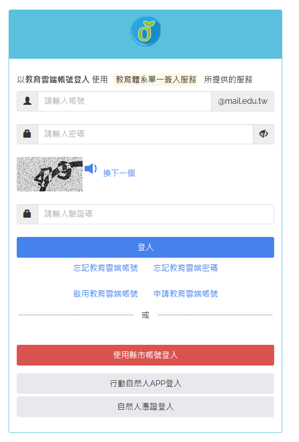
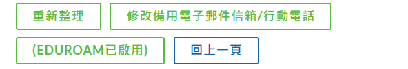

# 如何（作為學生）登入教育雲，並且開始使用eduroam wifi

因為最近花費了大約10分鐘在網路上找尋如何登入教育雲並且成功啟用eduroam，所以把方法留下來做備忘。

要先想辦法弄到SSO入口的帳號，帳號可以使用使用線上帳號登入、或者啟用帳號（從openid）、新建帳號也可以。網址：

[SSO登入](https://www.sso.edu.tw/)

登入之後要確保你的帳號啟用eduroam，可能需要幾分鐘才能在wifi上使用你的帳號密碼連線：

然後就可以在wifi裡加入eduroam的網路了。

- 帳號：教育雲端帳號@mail.edu.tw（例如matt100000@mail.edu.tw）
- 密碼：SSO的密碼（不知道可以直接重設密碼）

這樣就可以使用eduroam了。

## 參考

- [NEHS-eduroam網路設定](https://www.nehs.hc.edu.tw/wp-content/uploads/sites/40/2022/01/NEHS-eduroam%E7%B6%B2%E8%B7%AF%E8%A8%AD%E5%AE%9A.pdf)
- [教育體系單一簽入服務](https://www.sso.edu.tw/)
